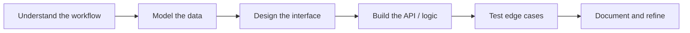

I build practical software systems that turn messy workflows into clear, usable, and maintainable tools. My work usually sits between backend logic, user interfaces, database behavior, and documentation. I care about software that is not only working, but also understandable, testable, and useful for real workflows. I am especially interested in systems that involve dashboards, admin tools, authentication flows, reporting views, operational records, learning workflows, inventory systems, and data-heavy interfaces.

## Current Focus

- Building backend and full-stack applications with `FastAPI`, `ASP.NET`, `React`, `TypeScript`, and relational databases.
- Improving software architecture through `SOLID`, clean architecture, design patterns, and system design practice.
- Working with data-driven interfaces such as dashboards, tables, filters, reporting views, status cards, and admin panels.
- Practicing QA-aware delivery through validation, edge cases, permissions, state handling, and handoff documentation.
- Preparing for `AWS Certified Cloud Practitioner` and `SAP Certified Associate – Integration Developer`.

## Tech Stack

  
  
  
  

  
  
  
  
  

  
  
  
  

  
  
  

  
  
  
  
  

### Currently Preparing

  

## What I Like Building

I enjoy projects where the software has to make a workflow clearer.

That usually means:

- Turning scattered records into dashboards, tables, filters, and useful status views.
- Designing backend APIs that match real user actions and business rules.
- Building interfaces that make information easier to scan, compare, and act on.
- Checking edge cases around invalid inputs, permissions, loading states, empty states, and filtered states.
- Writing documentation that helps another person understand what was built and why.

## Development Style

I prefer building software with a clear path from problem to implementation. Before coding, I like understanding the user flow, the records involved, the states that can happen, and the parts that need validation.

## GitHub Activity

## Open To

- Entry-level software engineering roles
- Backend development opportunities
- Full-stack development opportunities
- Software QA / QA-aware development roles
- Data analyst or SQL-heavy technical roles
- Internships, apprenticeships, and junior roles involving real features, documentation, and product reliability

---

**Useful clarity over noise. Build the thing, explain the thing, improve the thing.**

